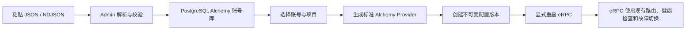

# Admin Alchemy 账号导入设计

## 目标

在独立的 Admin/Web 管理端增加 Alchemy 账号资料库和批量导入能力。管理员
可以把单个或多个账号 JSON 直接粘贴到输入框，完整保存账号资料，查看邮箱和
API Key，并在确认后把选中的账号应用为普通 eRPC Alchemy Provider。

这个功能只属于 Admin 管理层，不改变 eRPC 上游源码、Vendor 接口或公开配置
结构。原有的“eRPC 内置厂商 -> Alchemy（手动 API Key）”继续保留。

## 已确认方案

- 采用 A 方案：先导入 Admin 账号库，再选择项目和账号应用配置。
- 数据库继续使用现有 PostgreSQL，不新增 SQLite 或独立数据库。
- 输入方式是中文页面中的文本框，不提供文件上传作为必需路径。
- 支持单个 JSON 对象和多个逐行 JSON 对象（NDJSON）；可以同时接受 JSON 数组。
- 至少要求顶层 `email` 和 `api_key`；其他字段，包括未知字段和完整
  `checkpoint`，原样保存。
- 账号名称默认使用邮箱。
- 按现有单机约定，账号资料在 PostgreSQL 中明文保存；管理员密码仍只保存
  bcrypt 哈希。
- 账号导入不会启动、停止或重启 eRPC。
- 应用账号到项目时才创建新的配置版本；运行中的 eRPC 仍需由运行概览页面
  显式重启后才读取新版本。

## 当前实现边界

当前 Admin 数据库只有管理员、配置版本和运行状态三张表：
[schema.sql](E:/go/goProject/eRPC/Admin/internal/database/schema.sql:1)。当前
没有账号资产表或账号导入接口。

eRPC 的 Alchemy Vendor 只读取 `settings.apiKey` 并生成对应网络的 Alchemy
HTTP 上游：[alchemy.go](E:/go/goProject/eRPC/thirdparty/alchemy.go:409)。
邮箱密码、刷新令牌、Bearer Token、Alchemy 密码和 `checkpoint` 不属于 eRPC
运行配置，也不会发送给 eRPC 或第三方 RPC 服务。

现有前端已经把手动 Provider 保存到 `projects[].providers[]`，并通过
`ProviderConfig` 的标准字段生成上游：[providers.ts](E:/go/goProject/eRPC/web/src/config/providers.ts:30)。
账号导入应复用这条路径，而不是在 eRPC 配置中新增账号专用字段。

## 数据流



账号库是资料源，配置版本是运行快照。两者不能混为一层：账号资料更新后，
只有再次“应用到项目”才会生成新的运行配置。

## 数据库设计

新增 Admin 专用 `alchemy_accounts` 表，不给 eRPC 核心增加表或字段：

| 字段 | 类型 | 规则 | 用途 |
| --- | --- | --- | --- |
| `id` | `bigint identity` | 主键 | Admin 内部账号标识 |
| `email` | `text` | 必填；按 trim/lower 参与唯一判断 | 列表、去重和默认名称 |
| `name` | `text` | 必填；默认原始邮箱 | 管理端显示名称，可编辑 |
| `provider_id` | `text` | 必填；稳定唯一 | 投影到 eRPC Provider 的内部 ID |
| `api_key` | `text` | 必填 | 列表显示和投影到 eRPC 的字段 |
| `payload` | `jsonb` | 必须是 JSON 对象 | 完整保存导入对象及未来未知字段 |
| `created_at` | `timestamptz` | 默认当前时间 | 审计 |
| `updated_at` | `timestamptz` | 默认当前时间 | 审计 |

`payload` 是完整资料的来源，`email`、`name`、`provider_id` 和 `api_key` 是
用于索引、列表和配置投影的提取字段。服务层每次写入或更新时同时校验并更新
这些字段，避免列表字段和原始 JSON 分叉。

邮箱唯一约束使用 `vendor` 专用表中的规范化邮箱；同一邮箱不能产生两条账号
资产。`provider_id` 使用清理后的邮箱片段加稳定短后缀生成，避免 `@`、`.` 等
字符污染 eRPC Provider/上游 ID；页面显示名称仍是完整邮箱。

不把 `checkpoint` 拆成多张表，也不为当前样本中的每个 OAuth 字段建列。这样
新字段可以继续原样保存，且不会因导出格式变化而需要修改 eRPC 核心。

## 导入协议

前端发送现有 Admin JSON 请求格式，例如：

```json
{
  "text": "{\\"email\\":\\"user@example.com\\",\\"api_key\\":\\"key\\"}\\n{\\"email\\":\\"another@example.com\\",\\"api_key\\":\\"key2\\"}"
}
```

服务端使用 Go 标准库 `json.Decoder` 流式读取多个 JSON 值：

- 空白行忽略。
- 顶层对象直接作为一条记录。
- 顶层数组逐项作为记录。
- 每条记录必须是对象，且有非空 `email`、`api_key`。
- 其他键值不解释、不丢弃，完整写入 `payload`。
- 解析错误、字段缺失和重复冲突返回行号；错误消息不能包含密码、Token、
  API Key 或完整 JSON。

服务端重新解析并校验，浏览器预览只用于改善操作反馈，不能替代服务端校验。
现有全局请求体上限为 2 MiB，第一版沿用该限制；账号很多时分批粘贴。若实际
批量规模经常超过限制，再单独提高导入端点上限，不改变普通 Admin 接口限制。

### 重复策略

- 同一批次中同邮箱、同内容的记录合并为一条。
- 数据库中已有同邮箱且 `payload` 完全相同：报告“已存在，跳过”，不产生新行。
- 数据库中已有同邮箱但内容不同：报告“资料冲突”，不自动覆盖。
- 存在格式错误、必填字段错误或冲突时，本批次新增记录不部分提交；用户修正
  后重新导入。

这种策略让重复粘贴幂等，同时防止旧资料悄悄覆盖新凭据。

## Admin API

所有接口都要求现有管理员登录会话：

| 方法 | 路径 | 作用 |
| --- | --- | --- |
| `POST` | `/api/alchemy/accounts/import` | 解析并批量写入账号，返回创建/跳过/错误统计 |
| `GET` | `/api/alchemy/accounts` | 分页读取账号列表 |
| `GET` | `/api/alchemy/accounts/{id}` | 读取单条完整资料 |
| `PATCH` | `/api/alchemy/accounts/{id}` | 更新名称或完整 JSON，重新校验邮箱/API Key |
| `DELETE` | `/api/alchemy/accounts/{id}` | 删除账号资产；使用中的账号先阻止删除 |
| `POST` | `/api/alchemy/accounts/{id}/apply` | 把账号应用到指定项目并创建配置版本 |

列表响应只需要返回邮箱、名称、API Key、创建/更新时间以及当前最新配置中的
使用状态。详情和编辑接口才返回完整 `payload`，避免表格一次展开所有敏感字段。
API Key 按用户已确认的本机明文要求显示；其他密码和 Token 不在列表铺开。

## 应用到 eRPC 配置

应用操作输入项目 ID，可选输入网络范围；默认使用全部 Alchemy 支持网络。每个
账号生成一条标准 Provider：

```json
{
  "id": "alchemy-account-<stable-id>",
  "vendor": "alchemy",
  "settings": {
    "apiKey": "<account-api-key>"
  },
  "upstreamIdTemplate": "<PROVIDER>-<NETWORK>"
}
```

这里的 `<stable-id>` 是账号库生成的稳定内部值，不是邮箱中的特殊字符；页面
用邮箱作为名称展示。`settings` 中只写 `apiKey`，不写邮箱密码、刷新令牌、
Bearer Token 或 `checkpoint`。

应用行为必须幂等：

- 项目中已存在同一 `provider_id` 且内容相同：不重复添加。
- 已存在同一 `provider_id` 但配置不同：返回冲突，要求在上游管理中处理。
- 账号 API Key 更新后再次应用：更新该 Provider 并创建新版本。
- 一个账号可以应用到多个项目；每个项目内仍遵守 Provider ID 唯一校验。
- 原有手动 Alchemy Provider 不被修改，也不被自动合并。

应用成功只创建配置版本，不自动重启。运行概览的“重启并应用最新配置”仍是
唯一应用运行配置的动作。历史版本保持不可变；账号删除不会篡改历史版本。

## Web 页面

### 账号库

新增中文深色的 `Alchemy 账号` 管理入口，提供：

- 多行 JSON 输入框。
- 导入前的记录数量、邮箱、API Key、重复和错误预览。
- 分页账号表：名称、邮箱、API Key、应用状态、更新时间、编辑、删除。
- 详情编辑：可以查看和修改完整 JSON；保存前再次校验必填字段。
- `应用到项目` 操作：选择项目后生成配置版本，并明确提示“不自动重启”。

### 上游管理

现有 `接入方式` 选择器增加一个独立选项：

`eRPC 内置厂商 -> Alchemy 账号导入`

它只负责从账号库选择账号并应用到项目，不替换现有的：

`eRPC 内置厂商 -> Alchemy（手动 API Key）`

应用完成后，生成的记录仍显示在普通上游/厂商列表中，编辑时可继续使用现有
ProviderConfig 表单。账号库中的完整资料不会在普通上游表格中展开。

## 删除与历史版本

如果账号的 `provider_id` 出现在最新配置中，删除接口返回冲突并要求先从项目
配置移除；不能自动级联删除 Provider 或创建隐藏版本。删除后，历史配置版本仍
可能保留已经写入的 API Key，这是现有不可变版本模型的结果。需要彻底清理历史
密钥时，管理员必须显式删除不再需要的历史版本。

## 安全边界

- 完整账号资料只保存在 Admin PostgreSQL，不写入仓库、日志、错误消息或
  eRPC YAML。
- eRPC 配置版本仍会保存运行所需的 API Key；这是现有单机明文策略，不扩大到
  账号的其他凭据。
- 所有账号接口复用管理员会话认证。
- 服务端不能把任意账号 JSON 转发到第三方；导入只是解析和持久化。
- 账号详情页面可以编辑敏感字段，但列表和批量结果不回显完整 payload。
- 如果导入的凭据真实有效，导入前应在供应商侧撤销并重新生成曾经暴露的凭据。

## 测试验收

### Admin 后端

- 单对象、NDJSON、多对象数组和空白行解析。
- 非对象、截断 JSON、缺少 `email`、缺少 `api_key` 的行号错误。
- 未知字段和嵌套 `checkpoint` 完整保留。
- 同批次重复、数据库完全重复、同邮箱不同资料冲突。
- 批次出现错误时不留下部分新增记录。
- 列表、详情、编辑、删除的权限和错误状态。
- 账号应用生成 N 条唯一 Alchemy Provider，且只投影 `apiKey`。
- 原有手动 Alchemy Provider、其他项目和相邻 Provider 不被改变。
- 100、500 条账号批量导入的稳定性；超过请求体限制时返回明确错误。

### Web 前端

- 导入预览准确显示数量、邮箱、API Key 和错误行。
- 保存按钮在输入未改变时不可用，有改动才可提交。
- 导入、跳过、冲突和失败结果均使用中文提示。
- 账号编辑不会误删 `checkpoint` 或未知字段。
- 应用后显示新配置版本，并明确提示需要手动重启。
- 原手动 Alchemy 表单和上游 CRUD 回归测试继续通过。

## 非目标

- 不修改 `thirdparty/alchemy.go` 或 eRPC Vendor 接口。
- 不把邮箱登录、刷新令牌或 Bearer Token 接入 eRPC 请求流程。
- 不自动登录 Alchemy、不自动刷新账号、不调用邮箱服务。
- 不把完整账号资料写进 eRPC 配置、YAML 或 Provider settings。
- 不自动重启 eRPC，不修改历史配置版本。
- 不在第一版泛化成所有供应商账号体系；出现第二种账号格式时再评估抽象。
